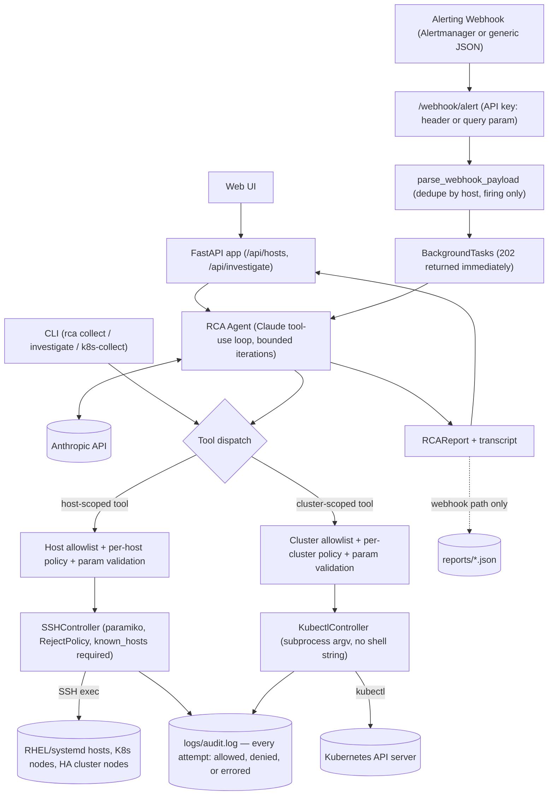
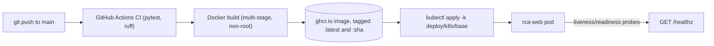

# Architecture: end-to-end flow

## Request flow

How a question (from the CLI, the web UI, or an alerting webhook) turns into a real RCA report.

Key properties this diagram is meant to make visible:
- **Every path converges on the same guardrail choke point** (`G1`/`G2`) before any command reaches a real host or cluster — the CLI, the web API, and the Claude agent's own tool calls all go through identical allowlist/policy/validation checks, not three separate implementations.
- **The webhook path never blocks the caller** — it returns `202` immediately and runs the investigation in the background, persisting the outcome (success or error) to `reports/` since nothing is watching the HTTP response.
- **`SSHController` and `KubectlController` are the only two places that ever touch a real target** — SSH commands are built from validated templates (never a raw shell string), kubectl calls are built as an argv list (never a shell string at all).
- **Audit logging is unified** regardless of target kind — a host and a cluster both write to the same `logs/audit.log`.

## Deployment pipeline

How a code change becomes a running pod.

CI gates the image push to `main` only (PRs build-check without publishing). The Kubernetes `Deployment` pulls by tag, and `automountServiceAccountToken: false` plus a non-root `securityContext` keep the pod itself minimally privileged — it authenticates to target hosts/clusters via explicitly mounted credentials (an SSH key, a kubeconfig), never its own pod identity.
